# ERD PostgreSQL - Smart Water Dispenser

## Tujuan

ERD ini menurunkan PRD backend ke model data PostgreSQL yang:

- mendukung flow vending machine berbasis MQTT + Midtrans
- tetap kompatibel dengan frontend customer yang sudah ada di repo
- mendukung admin dashboard yang saat ini sudah memiliki tab dashboard, riwayat/log IoT, kontrol, dan laporan lingkungan

## Scope

ERD dibagi menjadi 5 domain:

1. `customer identity & preferences`
2. `machine fleet & telemetry`
3. `transactions & payments`
4. `dispense execution & device command`
5. `admin, alerting & reporting`

## Frontend Alignment

### Customer Frontend Existing

- `/splash` butuh `guest_users`, `guest_sessions`
- `/explore` butuh `machines`, `machine_status_snapshots`, `sites`
- `/scan` dan `/scan/result` butuh `machines`, `transactions`, `payments`
- `/stats` butuh `customer_impact_snapshots`, `leaderboard_snapshots`
- `/profile` dan `/profile/history` butuh `guest_users`, `transactions`
- `/settings/*` butuh `guest_preferences`

### Admin Frontend Existing

- tab `dashboard` butuh agregasi `transactions`, `payments`, `machines`, `customer_impact_snapshots`
- tab `riwayat` butuh `machine_events`, `transactions`
- tab `kontrol` butuh `machine_status_snapshots`, `device_commands`
- tab `lingkungan` butuh `customer_impact_snapshots`, agregasi transaksi dan volume

## Mermaid ERD

```mermaid
erDiagram
    guest_users ||--o{ guest_sessions : has
    guest_users ||--|| guest_preferences : has
    guest_users ||--o{ transactions : creates
    guest_users ||--o{ customer_impact_snapshots : accumulates

    sites ||--o{ machines : contains
    machines ||--o{ machine_volume_options : offers
    machines ||--o{ machine_status_snapshots : reports
    machines ||--o{ machine_events : emits
    machines ||--o{ device_commands : receives
    machines ||--o{ transactions : serves
    machines ||--o{ alerts : raises

    transactions ||--|| payments : has
    transactions ||--o{ payment_notifications : receives
    transactions ||--o{ transaction_state_logs : logs
    transactions ||--|| dispense_sessions : runs

    admin_users ||--o{ admin_user_roles : maps
    admin_roles ||--o{ admin_user_roles : maps
    admin_users ||--o{ audit_logs : writes
    admin_users ||--o{ device_commands : triggers
    admin_users ||--o{ alerts : resolves

    sites {
      uuid id PK
      text code UK
      text name
      text address
      numeric lat
      numeric lng
      text timezone
    }

    machines {
      uuid id PK
      text machine_code UK
      uuid site_id FK
      text short_code UK
      text display_name
      boolean is_verified
      text firmware_version
      text connectivity_status
      text operation_status
      timestamptz last_seen_at
    }

    machine_volume_options {
      uuid id PK
      uuid machine_id FK
      integer volume_ml
      integer price_amount
      boolean is_active
      integer sort_order
    }

    machine_status_snapshots {
      uuid id PK
      uuid machine_id FK
      text state
      integer tank_level_pct
      boolean bottle_detected
      boolean pump_running
      integer filled_ml
      numeric flow_rate_lpm
      text source
      timestamptz reported_at
    }

    machine_events {
      uuid id PK
      uuid machine_id FK
      uuid transaction_id FK
      text topic
      text event_type
      jsonb payload
      timestamptz occurred_at
    }

    device_commands {
      uuid id PK
      uuid machine_id FK
      uuid transaction_id FK
      uuid issued_by_admin_id FK
      text command_type
      jsonb payload
      text delivery_status
      timestamptz issued_at
    }

    guest_users {
      uuid id PK
      text display_id UK
      text display_name
      timestamptz created_at
      timestamptz last_active_at
    }

    guest_sessions {
      uuid id PK
      uuid guest_user_id FK
      text session_token_hash
      text csrf_token_hash
      text user_agent
      inet last_ip
      timestamptz expires_at
    }

    guest_preferences {
      uuid guest_user_id PK, FK
      boolean notifications_enabled
      boolean public_leaderboard
      text language_code
      timestamptz updated_at
    }

    transactions {
      uuid id PK
      text order_id UK
      uuid guest_user_id FK
      uuid machine_id FK
      integer volume_ml
      integer gross_amount
      text payment_status
      text dispense_status
      text source_channel
      timestamptz created_at
      timestamptz completed_at
    }

    payments {
      uuid id PK
      uuid transaction_id FK
      text provider
      text provider_transaction_id
      text provider_reference
      text payment_type
      text transaction_status
      text fraud_status
      integer gross_amount
      text qr_string
      text qr_url
      timestamptz expires_at
    }

    payment_notifications {
      uuid id PK
      uuid transaction_id FK
      text provider
      text provider_notification_id
      jsonb payload
      text processing_status
      timestamptz received_at
    }

    transaction_state_logs {
      uuid id PK
      uuid transaction_id FK
      text from_state
      text to_state
      text source_type
      text source_ref
      jsonb metadata
      timestamptz created_at
    }

    dispense_sessions {
      uuid id PK
      uuid transaction_id FK
      uuid machine_id FK
      integer target_volume_ml
      integer actual_filled_ml
      numeric average_flow_rate_lpm
      timestamptz started_at
      timestamptz ended_at
      text result_status
    }

    customer_impact_snapshots {
      uuid id PK
      uuid guest_user_id FK
      date snapshot_date
      integer bottles_saved
      numeric co2_reduced_kg
      integer total_spent
      integer total_volume_ml
    }

    leaderboard_snapshots {
      uuid id PK
      date snapshot_date
      uuid guest_user_id FK
      integer points
      integer rank
      text scope
    }

    alerts {
      uuid id PK
      uuid machine_id FK
      text alert_type
      text severity
      text status
      jsonb context
      uuid resolved_by_admin_id FK
      timestamptz created_at
      timestamptz resolved_at
    }

    admin_users {
      uuid id PK
      text email UK
      text full_name
      text password_hash
      boolean is_active
      timestamptz created_at
    }

    admin_roles {
      uuid id PK
      text role_key UK
      text role_name
    }

    admin_user_roles {
      uuid admin_user_id FK
      uuid admin_role_id FK
    }

    audit_logs {
      uuid id PK
      uuid admin_user_id FK
      text action
      text target_type
      text target_id
      jsonb before_data
      jsonb after_data
      timestamptz created_at
    }
```

## Tabel Inti dan Alasan

### 1. `guest_users`

Dipakai untuk semua route customer yang saat ini berbasis guest identity:

- splash init
- profile
- stats
- history
- settings

### 2. `machines`

Satu baris per dispenser. Table ini menjadi anchor untuk:

- halaman explore
- scan verify
- kiosk route per machine
- admin fleet dashboard

### 3. `machine_status_snapshots`

Menyimpan status terakhir mesin yang cepat dibaca frontend tanpa harus replay log MQTT mentah.

### 4. `transactions`

Canonical record untuk satu order customer. Semua KPI admin dan history customer harus membaca dari sini.

### 5. `payments`

Dipisah dari `transactions` agar data Midtrans tidak bercampur dengan lifecycle dispensing.

### 6. `machine_events`

Raw-ish event log dari MQTT/device yang dipakai untuk:

- admin log IoT
- diagnosa insiden
- audit timeline

### 7. `device_commands`

Wajib dipisah agar admin actions dan automated backend commands bisa dilacak, di-retry, dan diaudit.

### 8. `customer_impact_snapshots`

Mendukung halaman `stats` dan `lingkungan` tanpa query agregasi berat setiap render.

## Indexing yang Disarankan

- `machines(machine_code)`
- `machines(short_code)`
- `machine_status_snapshots(machine_id, reported_at desc)`
- `machine_events(machine_id, occurred_at desc)`
- `transactions(order_id)`
- `transactions(machine_id, created_at desc)`
- `transactions(guest_user_id, created_at desc)`
- `payments(provider_transaction_id)`
- `payment_notifications(provider_notification_id)`
- `alerts(machine_id, status, created_at desc)`
- `customer_impact_snapshots(guest_user_id, snapshot_date desc)`
- `leaderboard_snapshots(snapshot_date, rank)`

## Catatan Desain

- `transactions` menyimpan status bisnis, bukan raw MQTT detail.
- `machine_events` menyimpan payload raw-ish untuk forensic dan debugging.
- `machine_status_snapshots` adalah current read model.
- `customer_impact_snapshots` dan `leaderboard_snapshots` adalah reporting read model.
- Bila nanti UI customer murni bergeser ke kiosk, domain guest/profile/stats tetap bisa dipertahankan untuk companion app tanpa memecah backend lagi.

